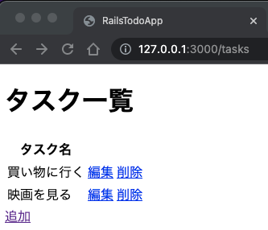

# rails-todo-app



## Usage
```
git clone https://github.com/ryo-manba/rails-todo-app
cd rails-todo-app

bundle install
rails db:migrate
rails server
```

Access to http://localhost:3000/tasks

## Author

[ryo-manba](https://twitter.com/ryo_manba)

## Licence

All code is released under the [MIT](https://github.com/ryo-manba/rails-todo-app/blob/main/LICENSE) license
